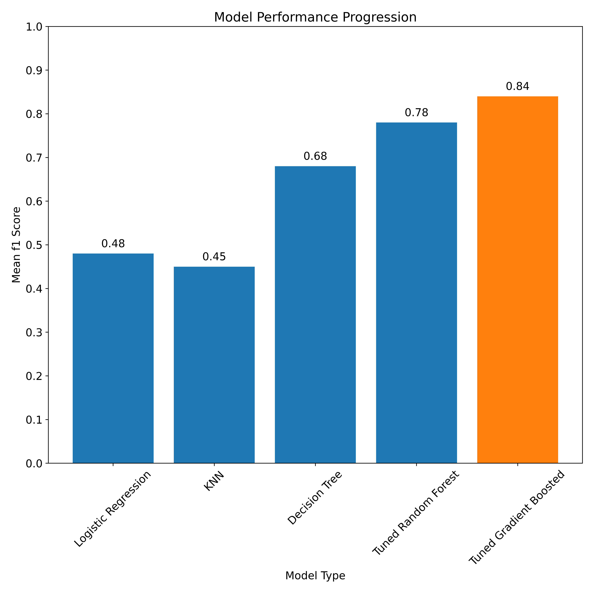
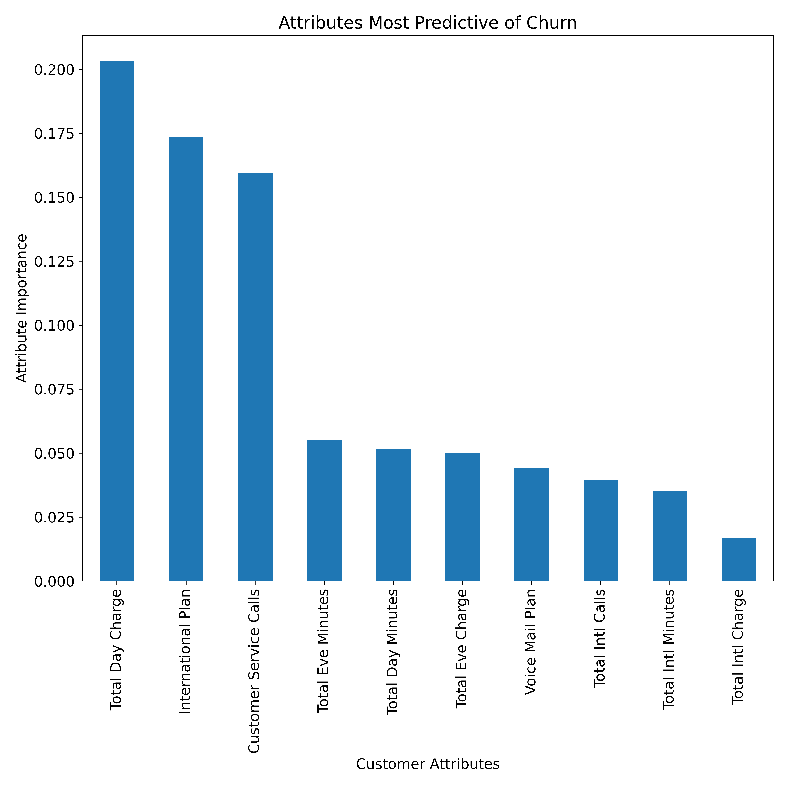

# Predicting Churn for SyriaTel Customers
Authors: John Sheehan, Tom Chapman

## Overview of Business Problem
We (Tall Guy Outreach, LLC) are customer outreach specialists retained by SyriaTel to help reduce customer loss. As one of only two mobile service providers in Syria, SyriaTel is in constant competition with their only competition (MTN Syria) for wireless customers. Because they have a binary choice of provider, it is relatively easy for customers to compare their options for wireless service and find the best price and service. It is therefore critical for SyriaTel to understand if price per minute is the most important driver of customer behavior or if there are other services that play a large role.

They would like to begin an outreach program to customers that are at a high risk of churning to avoid unnecessary runoff. The first step in that process is to use the dataset to identify predictors of churn in their customer base so that they can identify which customers are at a high risk of leaving. We have been charged with building a model that will effectively predict customer churn, and identifying which features of their dataset are most important within that prediction.

Given that SyriaTel intends to perform customer outreach to customer groups at risk of churn, we assume there is a significant cost associated with making the outreach group too broad. Providing a discount or promotional rate to customers that had no intention of shopping around might improve loyalty, but it will certainly hurt the company's bottom line. Similarly, we need to avoid false negative tests where we assume a customer is not at risk of churn when they are actually thinking about shoppiing around. A lost customer is likely to be very damaging to the company's revenue.

## Data Understanding
For this analysis, we used a dataset of 3,333 SyriaTel customers. The dataset included customer profile information typical to the wireless space--phone number, state, area code, etc.--along with usage statistics and an indicator of whether or not the customer ultimately left SyriaTel (churned). The churn boolean is our target variable for this analysis, and we will utilize nearly all of the other features as variables in our model. The only feature we elect to drop entirely is phone number. In this dataset, the area code has been split into another column so the phone number simply acts as a unique identifier for every customer. 

## Modelling
Our modelling efforts involved an iterative process through different classifiers to find the two that performed best with default hyperparameters. We evaluated our model performance using a cross-validated f1 score to balance the need to avoid both false positives and false negatives. We then utilized a grid search to tune the hyperparameters of our two best performing models in an attempt to further improve performance. The models are presented in order within the [completed notebook](SyriatelChurnNotebook.ipynb) from worst to best performing to demonstrate our iterative process. For the purposes of this summary, we will focus on the final gradient boosted classifier model.

The following graph shows the f1 score of each successive model, and highlights the superior performance of the gradient-bossted classifier.

## Results
In this section, we will discuss the performance and validity of our model, as well as the most important features it identified in predicting customer churn. With a cross-validated mean F1 score of 0.799 on unseen data, we can say that our model is doing a reasonable job of accurate predictions while avoiding false positives and false negatives. As noted in the business problem section, there are significant consequences of either false positive or false negative predictions, so we prioritize avoiding these incorrect predictions over perfect accuracy. 

The model identified total day charge, use of an international plan, and number of customer service calls as the three strongest indicators of churn within the data set. All of the features had some impact on churn, but these three are by far the most impactful, and will form the basis of our recommendations.

The ten most important features in predicting customer churn are visualized as follows:

## Conclusion & Next Steps

Our final model performed similarly on the train and test data, and with an f1 score of 0.79, it is proving to be usable for prediction of churn. Further tuning with a larger dataset would likely produce superior results as our initial dataset of 3,333 records was relatively small. To further explore our model's findings, we performed some analysis of the most important features it identified.

* __Total Daily Charge__ For our exploration of total daily charge, we binned all customers into equally sized groups based on 20% quantiles of cost. Recall that our model predicted the amount a customer pays as the most important predictor of customer churn. When exploring churn within our quantiles, we observe that the highest rate of churn occurs among customers that pay the most for their service, which logically makes sense. Further, churn is second highest among customers that pay the least for their service. While initially surprising, in a pay by use structure, there may be a correlation between how much a customer pays for their service and how much they actually use it. In the smallest bucket of daily charge, we are likely capturing customers that rarely use their service and end up creating churn when they cancel an unused product. Further analysis would be needed to confirm.

* __International Plan Customers__ We also evaluated the churn rate within customers who subscribe to an international plan with SyriaTel. About 42% of international plan users end up cancelling their services, which is much higher than the 14% baseline. Additional data from SyriaTel specific to international calls and plan features could help identify the root cause of the high churn. At a minimum, a thorough review of the product offering is necessary to determine what deficiencies may exist.

* __Number of Customer Service Calls__ Similar to our other important variables, we explored the impact of number of calls to customer service on churn rate. We observed that the rate of churn increases as the number of calls to customer service increases. Further exploration is needed to determine whether the increased churn is due to deficiency in the quality of customer service, poor service quality or other unseen factors. While impossible to model with the data we have, one expects a correlation between number of calls to customer service and dissatisfaction with the service.

Using our model's predictions, we recommend that SyriaTel focus its outreach and captive marketing to three categories of customer:

- Customers that have the highest daily bills.
- Customers that utilize SyriaTel's international plan.
- Customers that frequently call SyriaTel's customer service department.

High churn among customers with the highest daily bills is an obvious consequence of sticker shock. SyriaTel might consider offering pricing incentives, discounts or other promotions to these high-value customers. They produce more revenue than lower-bill customers and therefore should be a more attractive target to retain. Discounted rates or incentives for customers with expensive daily bills could be a worthwhile mitigant to churn, especially for the top 20% of customers by revenue.

The high level of churn among customers with an international plan suggests that there are underlying problems with that service. Perhaps the cost structure needs to be tweaked, or service offering improved. SyriaTel should review and update its pricing as it deems appropriate, and ensure that the reliability of its international plan is on par with peers. It should also review the countries available to international plan customers and evaluate the breadth of service against its peer.

Given the model's performance identifying customers that are at risk of churn, we strongly urge SyriaTel to perform ongoing reviews of customer data using our model. As new customers sign on to the service, the composition of the customer base will change, and it will be useful important to have an up-to-date understanding of the at-risk customer pool.

## Next Steps

Given additional time and resources, we would like to explore the following questions:
- A larger selection of customer data would help us better train our model to identify and weight predictors of churn.
- Further review of customer usage patterns to understand how it interacts with cost.
- Further exploration of SyriaTel's product suite to help understand if there are products that enhance stickiness.
- Further analysis of SyriaTel's cost structure to help tailor a sensible outreach program.

## For More Information

See the full analysis in the [Jupyter Notebook](SyriatelChurnNotebook.ipynb) or review [this presentation](SyriatelChurnPresentation.pdf).

For additional info, contact John Sheehan or Tom Chapman as follows:

- John:  johnjsheehan8@gmail.com  
- Tom:   thomas.h.chapman@gmail.com
 
## Repository Contents
- data
- images
- working notebooks
- .gitignore
- README.md
- SyriatelChurnNotebook.ipynb
- SyriatelChurnPresentation.pdf

 